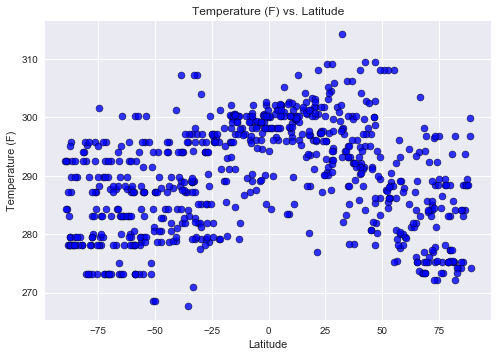
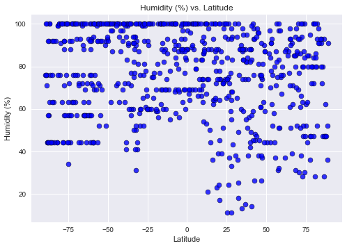
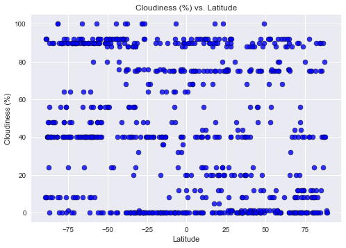
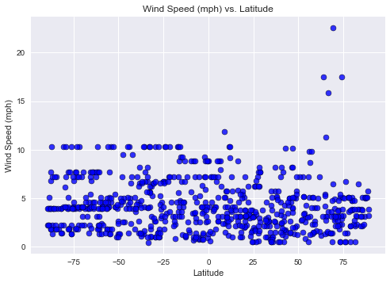

# Three observable trends based on the waether data
Trend 1: We see a higher variation in humidity in cities in higher latitudes, while humidity is consistently mid to hight in areas of lower latitues
Trend 2: Temperatures rise in areas with higher latitudes
Trend 3: Cloudiness has a consistent variation across latitude and does not seem to be dependent on latitude

```python
from citipy import citipy
import json
from pprint import pprint
import requests
from random import uniform
import pandas as pd
from API_KEYS import OWM_API
import matplotlib.pyplot as plt

```


```python
# Get random range of Lat and Long
LatLng=[]
def newpoint():
   return uniform(-180,180), uniform(-90, 90)

points = (newpoint() for x in range(800))
for point in points:
    LatLng.append(point)
```


```python
# Create dataframe to hold coordinates
Lat=[]
for i in range(len(LatLng)):
    Lat.append(LatLng[i][1])

Lng=[]
for i in range(len(LatLng)):
    Lng.append(LatLng[i][0])
    
LatLng_df = pd.DataFrame({
    'Lat': Lat,
    'Lng': Lng
})
LatLng_df.head()
```


<div>
<style scoped>
    .dataframe tbody tr th:only-of-type {
        vertical-align: middle;
    }

    .dataframe tbody tr th {
        vertical-align: top;
    }

    .dataframe thead th {
        text-align: right;
    }
</style>
<table border="1" class="dataframe">
  <thead>
    <tr style="text-align: right;">
      <th></th>
      <th>Lat</th>
      <th>Lng</th>
    </tr>
  </thead>
  <tbody>
    <tr>
      <th>0</th>
      <td>9.134759</td>
      <td>-164.057578</td>
    </tr>
    <tr>
      <th>1</th>
      <td>-43.701199</td>
      <td>-91.658206</td>
    </tr>
    <tr>
      <th>2</th>
      <td>-26.264686</td>
      <td>24.966644</td>
    </tr>
    <tr>
      <th>3</th>
      <td>35.467973</td>
      <td>118.796715</td>
    </tr>
    <tr>
      <th>4</th>
      <td>-87.621903</td>
      <td>-152.066012</td>
    </tr>
  </tbody>
</table>
</div>


```python
#use citipy to get city names for those coordinates and add to dataframe
cities=[]
for index, row in LatLng_df.iterrows():
 
   # get lat/lon from df
    lat=row['Lat']
    lng=row['Lng']

    city = citipy.nearest_city(lat,lng)
    cities.append(city.city_name )
    LatLng_df.loc[index, "City"] = city.city_name
    
#cities
LatLng_df.head()
```


<div>
<style scoped>
    .dataframe tbody tr th:only-of-type {
        vertical-align: middle;
    }

    .dataframe tbody tr th {
        vertical-align: top;
    }

    .dataframe thead th {
        text-align: right;
    }
</style>
<table border="1" class="dataframe">
  <thead>
    <tr style="text-align: right;">
      <th></th>
      <th>Lat</th>
      <th>Lng</th>
      <th>City</th>
    </tr>
  </thead>
  <tbody>
    <tr>
      <th>0</th>
      <td>9.134759</td>
      <td>-164.057578</td>
      <td>makakilo city</td>
    </tr>
    <tr>
      <th>1</th>
      <td>-43.701199</td>
      <td>-91.658206</td>
      <td>castro</td>
    </tr>
    <tr>
      <th>2</th>
      <td>-26.264686</td>
      <td>24.966644</td>
      <td>vryburg</td>
    </tr>
    <tr>
      <th>3</th>
      <td>35.467973</td>
      <td>118.796715</td>
      <td>juxian</td>
    </tr>
    <tr>
      <th>4</th>
      <td>-87.621903</td>
      <td>-152.066012</td>
      <td>mataura</td>
    </tr>
  </tbody>
</table>
</div>


```python

```

    {'base': 'stations',
     'clouds': {'all': 20},
     'cod': 200,
     'coord': {'lat': 48.14, 'lon': 11.58},
     'dt': 1529011200,
     'id': 2867714,
     'main': {'humidity': 93,
              'pressure': 1018,
              'temp': 283.88,
              'temp_max': 285.15,
              'temp_min': 282.15},
     'name': 'Munich',
     'sys': {'country': 'DE',
             'id': 4887,
             'message': 0.0054,
             'sunrise': 1528945976,
             'sunset': 1529003731,
             'type': 1},
     'visibility': 10000,
     'weather': [{'description': 'few clouds',
                  'icon': '02n',
                  'id': 801,
                  'main': 'Clouds'}],
     'wind': {'speed': 0.5}}


```python
# Loop through the cities_pd and run a lat/long search for each city
query_params = {
    'appid': OWM_API,
    'units': 'standard'
}
for index, row in LatLng_df.iterrows():
    url = "http://api.openweathermap.org/data/2.5/weather"

    city = row['City']

    # update address key value
    query_params['q'] = f"{city}"

    # make request, print url
    weather_response = requests.get(url, params=query_params)
    
    # convert to json
    weather_json = weather_response.json()
    #pprint(weather_json)
    
    # since the weather API does not have information for all cities, a try-except statement was added
    try:
        temperature = weather_json["main"]["temp"]
        humidity= weather_json["main"]["humidity"]
        cloudiness = weather_json["clouds"]["all"]
        windSpeed= weather_json["wind"]["speed"]

        LatLng_df.loc[index, "temperature"] = temperature 
        LatLng_df.loc[index, "humidity"] = humidity
        LatLng_df.loc[index, "cloudiness"] = cloudiness
        LatLng_df.loc[index, "windSpeed"] = windSpeed
    except (KeyError, IndexError):
        print("Missing field/result... skipping.")
    


```

    Missing field/result... skipping.
    Missing field/result... skipping.
    Missing field/result... skipping.
    Missing field/result... skipping.
    Missing field/result... skipping.
    Missing field/result... skipping.
    Missing field/result... skipping.
    Missing field/result... skipping.
    Missing field/result... skipping.
    Missing field/result... skipping.
    Missing field/result... skipping.
    Missing field/result... skipping.
    Missing field/result... skipping.
    Missing field/result... skipping.
    Missing field/result... skipping.
    Missing field/result... skipping.
    Missing field/result... skipping.
    Missing field/result... skipping.
    Missing field/result... skipping.
    Missing field/result... skipping.
    Missing field/result... skipping.
    Missing field/result... skipping.
    Missing field/result... skipping.
    Missing field/result... skipping.
    Missing field/result... skipping.
    Missing field/result... skipping.
    Missing field/result... skipping.
    Missing field/result... skipping.
    Missing field/result... skipping.
    Missing field/result... skipping.
    Missing field/result... skipping.
    Missing field/result... skipping.
    Missing field/result... skipping.
    Missing field/result... skipping.
    Missing field/result... skipping.
    Missing field/result... skipping.
    Missing field/result... skipping.
    Missing field/result... skipping.
    Missing field/result... skipping.
    Missing field/result... skipping.
    Missing field/result... skipping.
    Missing field/result... skipping.
    Missing field/result... skipping.
    Missing field/result... skipping.
    Missing field/result... skipping.
    Missing field/result... skipping.
    Missing field/result... skipping.
    Missing field/result... skipping.
    Missing field/result... skipping.
    Missing field/result... skipping.
    Missing field/result... skipping.
    Missing field/result... skipping.
    Missing field/result... skipping.
    Missing field/result... skipping.
    Missing field/result... skipping.
    Missing field/result... skipping.
    Missing field/result... skipping.
    Missing field/result... skipping.
    Missing field/result... skipping.
    Missing field/result... skipping.
    Missing field/result... skipping.
    Missing field/result... skipping.
    Missing field/result... skipping.
    Missing field/result... skipping.
    Missing field/result... skipping.
    Missing field/result... skipping.
    Missing field/result... skipping.
    Missing field/result... skipping.
    Missing field/result... skipping.
    Missing field/result... skipping.
    Missing field/result... skipping.
    Missing field/result... skipping.
    Missing field/result... skipping.
    Missing field/result... skipping.
    Missing field/result... skipping.
    Missing field/result... skipping.
    Missing field/result... skipping.
    Missing field/result... skipping.
    Missing field/result... skipping.
    Missing field/result... skipping.


```python
# Remove the rows with missing data
LatLng_df = LatLng_df.dropna(how="any")
LatLng_df.head()
```


<div>
<style scoped>
    .dataframe tbody tr th:only-of-type {
        vertical-align: middle;
    }

    .dataframe tbody tr th {
        vertical-align: top;
    }

    .dataframe thead th {
        text-align: right;
    }
</style>
<table border="1" class="dataframe">
  <thead>
    <tr style="text-align: right;">
      <th></th>
      <th>Lat</th>
      <th>Lng</th>
      <th>City</th>
      <th>temperature</th>
      <th>humidity</th>
      <th>cloudiness</th>
      <th>windSpeed</th>
    </tr>
  </thead>
  <tbody>
    <tr>
      <th>0</th>
      <td>9.134759</td>
      <td>-164.057578</td>
      <td>makakilo city</td>
      <td>302.650</td>
      <td>66.0</td>
      <td>40.0</td>
      <td>5.10</td>
    </tr>
    <tr>
      <th>1</th>
      <td>-43.701199</td>
      <td>-91.658206</td>
      <td>castro</td>
      <td>278.672</td>
      <td>100.0</td>
      <td>92.0</td>
      <td>5.01</td>
    </tr>
    <tr>
      <th>2</th>
      <td>-26.264686</td>
      <td>24.966644</td>
      <td>vryburg</td>
      <td>278.622</td>
      <td>61.0</td>
      <td>0.0</td>
      <td>3.86</td>
    </tr>
    <tr>
      <th>4</th>
      <td>-87.621903</td>
      <td>-152.066012</td>
      <td>mataura</td>
      <td>279.522</td>
      <td>92.0</td>
      <td>48.0</td>
      <td>1.81</td>
    </tr>
    <tr>
      <th>5</th>
      <td>48.919220</td>
      <td>120.745669</td>
      <td>yakeshi</td>
      <td>289.472</td>
      <td>90.0</td>
      <td>12.0</td>
      <td>5.71</td>
    </tr>
  </tbody>
</table>
</div>


```python

# Plot the scatter graph
plt.title("Temperature (F) vs. Latitude")
plt.xlabel("Latitude")
plt.ylabel("Temperature (F)")

# one scatter plot for each Type ( Urban, suburban, rural)
scatter=plt.scatter( LatLng_df ["Lat"],LatLng_df ["temperature"], marker="o",c= "blue",
                     alpha=0.8,edgecolor="black",linewidths=0.5 )


# Customize the grid
plt.style.use('seaborn')
```





```python
# Plot the scatter graph
plt.title("Humidity (%) vs. Latitude")
plt.xlabel("Latitude")
plt.ylabel("Humidity (%)")

# one scatter plot for each Type ( Urban, suburban, rural)
scatter=plt.scatter( LatLng_df ["Lat"],LatLng_df ["humidity"], marker="o",c= "blue",
                     alpha=0.8,edgecolor="black",linewidths=0.5)


# Customize the grid
plt.style.use('seaborn')
```





```python
# Plot the scatter graph
plt.title("Cloudiness (%) vs. Latitude")
plt.xlabel("Latitude")
plt.ylabel("Cloudiness (%)")

# one scatter plot for each Type ( Urban, suburban, rural)
scatter=plt.scatter( LatLng_df ["Lat"],LatLng_df ["cloudiness"], marker="o",c= "blue",
                     alpha=0.8,edgecolor="black",linewidths=0.5)


# Customize the grid
plt.style.use('seaborn')
```





```python
# Plot the scatter graph
plt.title("Wind Speed (mph) vs. Latitude")
plt.xlabel("Latitude")
plt.ylabel("Wind Speed (mph)")

# one scatter plot for each Type ( Urban, suburban, rural)
scatter=plt.scatter( LatLng_df ["Lat"],LatLng_df ["windSpeed"], marker="o",c= "blue",
                     alpha=0.8,edgecolor="black",linewidths=0.5)


# Customize the grid
plt.style.use('seaborn')
```




